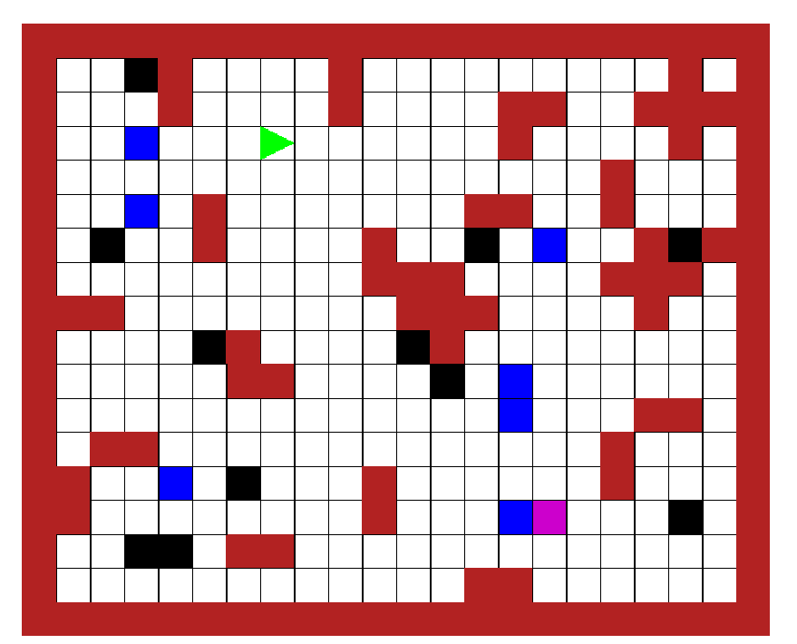
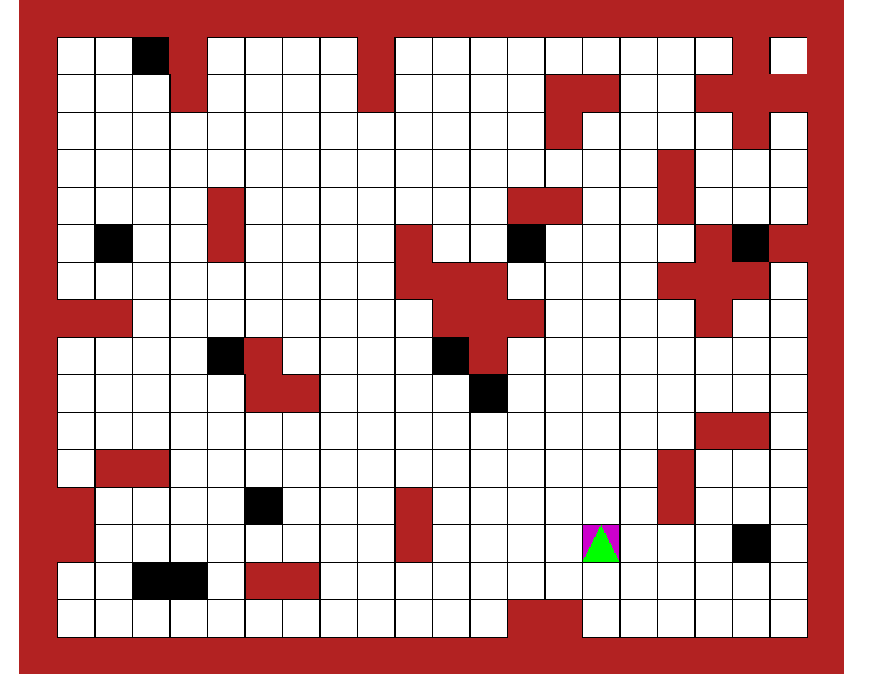

# Hakan YARDIM - 11/11/2024 - robot_simulator

Dear User,
This robot simulation is aimed to complete the stage 7 for the C coursework. 

An arena consisting of gridTile structs is built and stored in a 2D array. There are specific types of gridTiles including empty, markers, obstacles, walls, and home tiles. The size of the arena is set to be between a reasonable random size and the irregular shape of the arena is primarily determined by the generation of "L", "+" and "-" shaped walls. To ensure that the robot can access each marker, no markers are spawned in tiles surrounded by walls in all adjacent sides. 

In order to traverse the 2D array, the robot uses a depth-first-search (DFS) algorithm to collect all the markers and the uses the same algorithmic principle to return the markers to the home tile. The DFS aims to explore new tileGrids and was first implemented using a stack data structure. Currently, it uses a recursive backtracking algorithm. Whenever robot is in a new grid, if it can't determine an unvisited gridTile in its current orientation it starts to change its orientation to check for unvisited gridTiles. Otherwise, it will start to backtrack and check for unvisitied grids through changing its orientation once again. It will first collect all the markers thşs way and then find the home tile the same way. 

Below is the initial and end states of the robot after using this algorithm:

<table>
  <tr>
    <td>
      <h3>Initial State</h3>
      
    </td>
    <td>
      <h3>End State</h3>
      
    </td>
  </tr>
</table>
